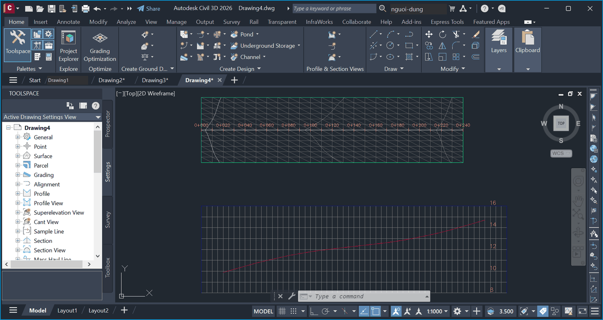
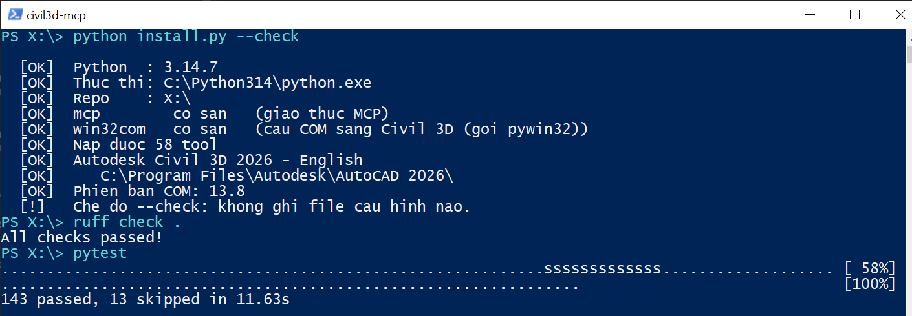

# civil3d-mcp

***English** · [Tiếng Việt](README.vi.md)*

[](https://github.com/xuantinhnbs-rgb/civil3d-mcp/actions/workflows/ci.yml)
[](LICENSE)
[](https://www.python.org/)
[](#requirements)

An MCP server that drives **Autodesk Civil 3D** over COM. It lets Claude — or any
MCP client such as Claude Code, Claude Desktop, Cursor or Cline — build
**TIN surface → alignment → profile → corridor → cross sections → deviation
statistics** from filtered point-cloud data, and export the numbers straight to
CSV.

It was written for as-built BIM research on transport infrastructure, where the
deliverable is a table of deviations with a defensible provenance, not a picture.

```
filtered point cloud            civil3d-mcp                         report
────────────────────            ───────────                         ──────
LAS/LAZ ──filter──> XYZ  ──> TIN surface ──┬─> volume surface ──> cut/fill quantities
                                           ├─> alignment ─> profile ─> station/elevation CSV
                                           ├─> corridor ─> sample lines ─> cross-section CSV
                                           └─> check points ──> RMSE, standard deviation
```

The point-cloud filtering step is out of scope here. A separate MCP server covers
it: [recap-mcp](https://github.com/xuantinhnbs-rgb/recap-mcp) reads Autodesk ReCap
projects and analyses LAS/LAZ. The two repositories are independent — either is
useful on its own.

Every tool returns JSON with an `ok` key — `{"ok": true, ...}` on success,
`{"ok": false, "error": "..."}` on failure. No tool lets an exception escape, so
the model receives a readable message instead of a raw COM stack trace.

> **Note on documentation language.** Code comments and the detailed guide are
> written in Vietnamese. This README is the English entry point; the Vietnamese
> one is [README.vi.md](README.vi.md).

---

## What it looks like

### A TIN surface built entirely through MCP calls



No project file was opened: a new drawing from the Civil 3D template, then
`create_tin_surface` and `add_points_to_surface` to load the points, and
`create_alignment`, `create_profile_from_surface` and `create_profile_view` for
the rest. The full call sequence is in
[docs/images/README.md](docs/images/README.md).

### Verified on a machine with Civil 3D closed



`install.py --check` loads the server, counts its tools and reports which Civil 3D
it found; `ruff` is clean; the offline suite passes — with no Civil 3D session
open.

---

## Requirements

- **Windows.** Civil 3D's COM API is Windows-only.
- **Python 3.10 or newer**, with `pywin32` and `mcp`.
- **Autodesk Civil 3D.** Civil 3D runs **on top of AutoCAD**, but plain AutoCAD is
  **not** a substitute: the Surfaces/Alignments/Corridors collections only exist in
  Civil 3D. `check_civil3d_connection` detects that case and says so explicitly.

The offline test suite runs on a machine **without** Civil 3D installed.

## Verified environment

| Component | Value on the development machine |
|---|---|
| Civil 3D | 2026 (English), `C:\Program Files\Autodesk\AutoCAD 2026\` |
| COM version | **13.8** (`AeccXUiLand.AeccApplication.13.8`) |
| Underlying AutoCAD | `AutoCAD.Application.25.1` |
| Python | 3.14, with `pywin32` and `mcp` |

The COM version number does **not** track the release year. The server discovers it
from the registry rather than hardcoding it, so it keeps working when you upgrade —
but the API signatures were measured against 13.8, so another version needs
re-testing.

---

## Install

```powershell
git clone https://github.com/xuantinhnbs-rgb/civil3d-mcp.git
cd civil3d-mcp

pip install -r requirements.txt
python install.py
```

`install.py` detects the Python interpreter and repository directory **on the
machine it is running on**, verifies the packages, loads the server to confirm its
tools register, reports which Civil 3D installation and COM version it found, and
only then writes `.mcp.json`. You never edit a path by hand.

```powershell
python install.py --check            # verify only, write nothing
python install.py --claude-desktop   # also write Claude Desktop's config
```

Then open Claude Code **in the repository root** and run `/mcp` to confirm the
server connected.

`.mcp.json` is deliberately **not** in the repository: it contains absolute paths
valid on exactly one machine. See [.mcp.json.example](.mcp.json.example).

Civil 3D does **not** need to be running at install time — the server attaches to a
session lazily.

---

## Architecture

Civil 3D runs **on top of AutoCAD**: the process is still `acad.exe`, and the
automation API comes in two layers stacked on each other.

| Layer | Obtained with | Gives you |
|---|---|---|
| AutoCAD | `GetActiveObject("AutoCAD.Application.25.1")` | ModelSpace, Layers, SendCommand, handles |
| Civil 3D – land | `acad.GetInterfaceObject("AeccXUiLand.AeccApplication.13.8")` | Surfaces, Alignments, Profiles, Points, Sites |
| Civil 3D – roadway | `acad.GetInterfaceObject("AeccXUiRoadway.AeccRoadwayApplication.13.8")` | Corridors, Assemblies, Subassemblies |

| File | Role |
|---|---|
| `civil3d_mcp/com.py` | The dedicated COM thread, HRESULT translation, registry version discovery, connection |
| `civil3d_mcp/client.py` | `Civil3DClient`: holds the connection, retries, document access, VARIANT packing |
| `civil3d_mcp/geometry.py` | Pure-Python computation: batching, station series, RMSE statistics, CSV |
| `civil3d_mcp/surfaces.py` | TIN surfaces, volume surfaces, point loading, sampling, comparison |
| `civil3d_mcp/alignments.py` | Alignments, profiles, profile views, station ↔ coordinate conversion |
| `civil3d_mcp/corridors.py` | Corridors, baselines, sample lines, cross sections |
| `civil3d_mcp/research.py` | Report deliverables: deviation grids, CSV, Markdown reports |
| `civil3d_mcp/server.py` | The MCP tool surface |

### Three design decisions worth knowing

**One single COM thread.** The MCP server runs tools in a thread pool, and COM does
not allow interface pointers across threads. Every call — including the connection
check and plain document property reads — goes through `Civil3DClient.run()`.
Missing one entry point produces no error at that line; it makes a failure appear
later, somewhere unrelated.

**Writes verify themselves.** A COM call that does not raise is *not* evidence the
operation took effect. Every writing tool reads the result back and returns
`verified` and `verified_by`. `add_points_to_surface`, for example, reports
`points_added_measured` computed from the before/after difference in
`Statistics.NumberOfPoints` — not the number of points it sent.

**The first batch is a calibration.** `AddPointMultiple` takes a SAFEARRAY whose
layout the documentation does not pin down, and the wrong layout silently adds
nothing. So the first batch goes out in the flat layout and is then measured; if
the count did not rise, the server switches to array-of-arrays. The
`array_layout_used` key in the result says which one worked.

---

## Tools (58)

### Connection and drawings
| Tool | What it does |
|---|---|
| `check_civil3d_connection` | **Call this first.** Distinguishes: not installed / not running / attached to plain AutoCAD by mistake |
| `launch_civil3d` | Starts it with the right `/ld AecBase.dbx /p <<C3D_Metric>> /product C3D` arguments |
| `create_new_drawing` | New drawing from a template — the correct way to start (opening a .dwt directly edits your template). **`template_path` must be a full path**; see the note below |
| `get_drawing_info`, `list_open_drawings`, `open_drawing`, `save_drawing`, `switch_drawing` | Drawing management |
| `send_civil3d_command` | Escape hatch for what COM does not expose. **Asynchronous, returns no result** |
| `get_environment_report` | A software-version record for the "experimental environment" section of a paper |

### Surfaces
| Tool | What it does |
|---|---|
| `list_surfaces`, `get_surface_info` | Listing, statistics, bounds, definition components |
| `create_tin_surface` | An empty TIN surface |
| `add_points_to_surface` | Load points over COM — for a few thousand points |
| `add_point_file_to_surface` | Attach a point file on disk — **use this for real scan data** |
| `build_surface_from_xyz_file` | One step: create + load + set `max_triangle_length` + rebuild |
| `import_surface_file` | LandXML / TIN / DEM |
| `set_surface_build_options`, `rebuild_surface`, `delete_surface` | TIN build parameters, rebuild, delete (needs `confirm=True`) |
| `create_volume_surface` | Compare two surfaces → cut/fill/net quantities |
| `sample_surface_elevations`, `sample_surface_section` | Elevation at points; a section along a line |
| `compare_surface_to_check_points` | RMSE against independently surveyed check points |
| `compare_two_surfaces` | Elevation deviation grid over the overlapping region |

### Alignments and profiles
| Tool | What it does |
|---|---|
| `list_alignments`, `get_alignment_info` | Finds both siteless alignments and alignments inside Sites |
| `create_alignment`, `create_alignment_from_polyline` | From a vertex list or from a polyline |
| `alignment_station_offset`, `alignment_point_location`, `sample_alignment` | Station ↔ coordinate conversion |
| `list_profiles`, `create_profile_from_surface`, `sample_profile` | Profiles from a surface; station/elevation/grade tables |
| `compare_profiles` | As-built vs design elevation deviation by station |
| `create_profile_view` | The profile view frame |

### Corridors and cross sections
| Tool | What it does |
|---|---|
| `list_assemblies`, `list_corridors`, `get_corridor_info` | Listing, baselines, station ranges, corridor surfaces |
| `list_assembly_library`, `import_assembly` | **How to get an assembly when COM cannot create one**: copy it from Civil 3D's sample assembly library |
| `create_corridor`, `add_corridor_baseline`, `rebuild_corridor` | Build and compute a corridor |
| `sample_corridor_surface` | Corridor surface elevations |
| `corridor_points`, `corridor_shape_areas` | Computed corridor geometry: coded points, per-layer areas |
| `create_sample_lines`, `list_sample_line_groups`, `create_sections`, `read_sections` | Sample lines, their groups, and cross sections |

### Exporting data
| Tool | What it does |
|---|---|
| `export_surface_comparison` | Grid CSV + statistics CSV + a Markdown report recording the conditions the numbers came from |
| `export_profile_csv`, `export_sections_csv` | Profiles and cross sections to CSV |
| `export_check_point_report` | Check-point comparison, CSV with RMSE |
| `export_corridor_points_csv` | Corridor geometry points to CSV |
| `export_corridor_quantities` | Area by station plus volume per structural layer |

### A note on `create_new_drawing`

`template_path` takes a **full path**, not a filename:

```
C:\Users\<you>\AppData\Local\Autodesk\C3D 2026\enu\Template\_Autodesk Civil 3D (Metric) NCS.dwt
```

Pass a bare filename and Civil 3D quietly falls back to its default template. That
drawing has exactly one surface style, `Standard`, which displays nothing — so the
symptom is a surface that builds successfully, reports the right statistics, and is
invisible on screen. No error is raised anywhere.

The `template` key in the result echoes the path that was used, so **`null` there
means no template was applied** — check it rather than assuming.

Style names must also exist in the drawing. A style that is not there makes
`AddTinSurface` fail with `E_INVALIDARG`, the same code as a missing `BaseLayer`,
so the error message does not point at the real cause. The Metric NCS template
ships 14 surface styles; `Contours and Triangles` is the clearest for a figure.

---

## Known limits

These are **properties of Civil 3D's COM API**, not gaps this server could patch:

1. **Assemblies and subassemblies cannot be created *from scratch*.** `AeccAssemblies`
   exposes only `Count` and `Item` — checked against the type library, not guessed.
   But they **can be copied**: `import_assembly` inserts a drawing containing an
   assembly and the assembly comes with it. Civil 3D ships 16 sample assembly
   drawings in `C:\ProgramData\Autodesk\C3D 2026\enu\Assemblies\Metric\` (see
   `list_assembly_library`), so in practice this is no longer a blocker.
2. **Corridor targets cannot be assigned.** `AeccBaselineRegion` has no target
   members, so any subassembly needing a target surface (all daylight / side-slope
   types) makes `Rebuild` fail with `0x80004005`. Two ways forward: pick an assembly
   without daylight subassemblies, or delete that subassembly after import
   (`subassembly.Delete()` does work over COM).
3. **Corridor surfaces cannot be created.** `AeccCorridorSurfaces` is read-only too.
   Use `corridor_points` / `corridor_shape_areas` instead: they read the computed
   corridor geometry directly, which is enough for a station/offset/elevation table
   and for per-layer quantities.
4. **Subassembly parameters cannot be edited.** `ParamsDouble`/`ParamsLong`/… return
   a COM object on which neither `Count` nor `Item` resolves, and `CastTo` with a
   makepy'd type library still reports "Element not found". Lane width, cross slope
   and the like must be changed in Civil 3D's properties panel.
5. **`send_civil3d_command` is one-way.** COM returns when the command is queued; no
   error code comes back, and any command that waits for a mouse click will hang the
   UI. Verify with a reading tool after every command.
6. **The drawing must come from a Civil 3D template.** Creating a surface, alignment
   or profile requires a style that exists; a blank AutoCAD drawing has none, and the
   tool reports that clearly.
7. **LandXML cannot be exported over COM** (import only). Export goes through
   `send_civil3d_command` with `-LandXMLOut`, verified by checking the file on disk.
8. **Large corridors take a long time to rebuild** and COM blocks until finished.
   Read the `out_of_date` key: still `true` means the computation has not finished.
9. **Units follow the drawing.** The server does not convert. `get_drawing_info`
   returns `measurement` and `drawing_units` so you can check before reading numbers.
10. **Volume signs follow Civil 3D's convention:** cut is where the comparison
    surface is *below* the base surface. `create_volume_surface` states the
    convention in its result.

---

## Where COM differs from its documentation

The 16 differences listed in [README.vi.md](README.vi.md#khác-biệt-so-với-tài-liệu-com)
were **measured on Civil 3D 2026 (COM 13.8)**, not inferred: each is a call that was
refused, or returned nothing, until it was made the way the right-hand column
describes. They are all handled in this server; they are listed so that nobody
reading the code thinks those lines are redundant, and so the next person writing a
Civil 3D tool loses less time.

A few highlights:

- `Surfaces.AddTinSurface` demands **both `Layer` and `BaseLayer`**; omitting
  `BaseLayer` surfaces as a generic "Exception occurred".
- `Profiles.AddFromSurface` wants the surface **name as a string**, while
  `SampleLineGroups.Add` wants a **style object** — the opposite convention, in the
  same API.
- `Surfaces.Item(i)` hands back the **base `IAeccSurface` interface**, with no
  `Statistics`. The object returned by `AddTinSurface` at creation time carries the
  derived interface, so the same line of code works right after creating a surface
  and fails when the drawing is reopened in a later session.
- `AeccRoadwayDocument.Assemblies` **refuses the property itself** with
  `E_INVALIDARG` when the drawing has no assemblies, so "none yet" looks exactly like
  "the call is broken".

The full table, with all 16 rows and three further behavioural notes, is in the
Vietnamese README. A test asserts that the count stated in prose matches the number
of rows in the table — that sentence had already drifted once.

---

## Development

```powershell
pip install -r requirements-dev.txt

ruff check .                 # lint
pytest                       # offline suite; no Civil 3D needed
python install.py --check    # loads the server, prints tool count and Civil 3D version

# Live suite: builds real geometry in a running Civil 3D
$env:CIVIL3D_LIVE_TEST=1; pytest tests/test_live_civil3d.py
```

The first three are exactly what CI runs.

**The offline suite runs on a machine without Civil 3D** — which is why CI can run
it at all. It uses a fake COM layer to exercise the paths a real machine rarely
reaches:

- a COM call that "succeeds" without taking effect (creating a surface that does not
  appear, loading points that do not arrive);
- a wrong array layout being silently ignored, and the calibration step catching it;
- regressions for differences #1, #2 and #6 in the table — removing the `BaseLayer`
  assignment or dropping coordinates to 2D turns those tests red;
- two non-overlapping surfaces (the signature of mismatched coordinate systems)
  producing an error that names the cause;
- "busy" being distinguishable from "not running";
- deviation statistics: RMSE about zero differs from standard deviation about the
  mean when there is a bias.

The computation in `geometry.py` is tested against hand-computable values (a 3-4-5
triangle, the RMSE of a symmetric series, the area of a square), never against
reference values copied from a previous run.

**The live suite** (`CIVIL3D_LIVE_TEST=1`) builds two parallel planes exactly 0.05 m
apart over 100 × 40 m, then requires Civil 3D to return the analytic answer:

| Quantity | By hand | Civil 3D returns |
|---|---|---|
| RMSE against check points | 0.050 m | 0.050 m |
| Standard deviation (constant offset) | 0 | 0 |
| Fill volume | 100 × 40 × 0.05 = 200 m³ | 200.000 m³ |
| Longitudinal grade on the section | 0.020 | 0.020 |
| Profile elevation at Km0+000 / +100 | 10.00 / 12.00 m | 10.00 / 12.00 m |

"It ran without an error" is not the criterion: every step has to produce the right
number. This suite is what found all 16 API differences above.

See [CONTRIBUTING.md](CONTRIBUTING.md) for conventions and the checklist for adding
a tool, and [CHANGELOG.md](CHANGELOG.md) for what changed between versions.

---

## Troubleshooting

| Symptom | Fix |
|---|---|
| `/mcp` shows the server as not connected | Run `python install.py --check` |
| `ModuleNotFoundError: mcp` or `win32com` | `pip install -r requirements.txt` |
| Every tool says no session is running | Open Civil 3D, or call `launch_civil3d` (1–3 minutes) |
| Tools report being attached to plain AutoCAD | Plain AutoCAD cannot serve these tools — start Civil 3D itself |
| Creating a surface fails complaining about styles | The drawing is not from a Civil 3D template. Use `create_new_drawing` |
| `Rebuild` fails with `0x80004005` | The assembly has a daylight subassembly and corridor targets cannot be set over COM — see limit 2 |
| A comparison reports deviations of hundreds of metres | Mismatched coordinate systems; the error names the axis |
| Garbled output running scripts by hand | Set `PYTHONIOENCODING=utf-8` first |

---

## Security

This server hands a model direct control of the open drawing: it can delete
surfaces, save over files, and send arbitrary AutoCAD commands. Read
[SECURITY.md](SECURITY.md) before connecting it, and report vulnerabilities
privately rather than in a public issue.

---

## License

[MIT](LICENSE) — free for any use including commercial, keep the copyright notice.

Contributions are welcome in English or Vietnamese — see
[CONTRIBUTING.md](CONTRIBUTING.md) and [CODE_OF_CONDUCT.md](CODE_OF_CONDUCT.md).
